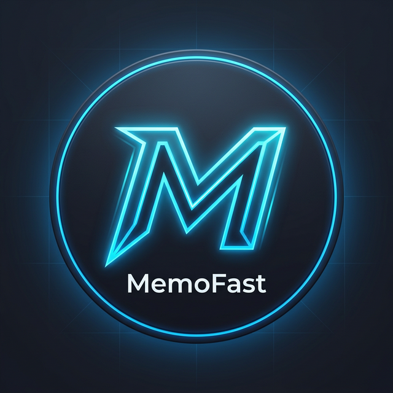

<p align="center">
  
</p>

<h1 align="center">🎮 MemoFast - Oyun Çeviri & Optimizasyon Aracı</h1>

<p align="center">
  <b>Oyunlarınızı Türkçe'ye çevirin, optimize edin ve yamalayın!</b>
</p>

<p align="center">
  
  
  
  
</p>

---

## 🚀 Özellikler

### 🔄 Çoklu Motor Desteği
- **Unreal Engine** → PAK dosyası açma, çevirme ve paketleme (AES key otomatik bulma)
- **Unity Engine** → Asset bundle çevirisi, font düzeltme
- **Cobra Engine** → Planet Zoo, Jurassic World vb. OVL çevirisi

### 🌍 Çeviri Motorları
- **Google Translate** → Ücretsiz, hızlı
- **DeepL** → Yüksek kaliteli çeviri
- **Gemini AI** → Bağlam duyarlı akıllı çeviri

### 🖥️ Ekran Çeviri (OCR)
- Oyun içi metin tanıma ve anlık çeviri
- Windows OCR, Tesseract ve EasyOCR desteği
- Sesli okuma (TTS) özelliği
- Kısayol tuşlarıyla hızlı kullanım

### 🎯 Ek Araçlar
- **Oyun Tarayıcı** → Steam, Epic Games, GOG ve Xbox oyunlarını otomatik bulma
- **Yedekleme Merkezi** → Orijinal dosyaları yedekleme/geri yükleme
- **Otomatik Güncelleme** → Uygulama güncellemelerini otomatik kontrol
- **Oyun Optimizasyonu** → Performans iyileştirme araçları

---

## 📦 İndirme & Kurulum

### 🎯 Hazır Sürüm (Önerilen)

Python bilmiyorsanız direkt indirip kullanabilirsiniz:

<p align="center">
  <a href="https://github.com/zibildak/memofast/releases/download/memofast1.1.2/MemoFast.1.1.2.zip">
    
  </a>
</p>

1. ZIP dosyasını indirin
2. Bir klasöre çıkarın
3. `MemoFast.exe` çalıştırın — bu kadar!

---

### 🛠️ Kaynak Koddan Çalıştırma (Geliştiriciler İçin)

```bash
# 1. Repoyu klonla
git clone https://github.com/zibildak/MemoFastv.git
cd MemoFastv

# 2. Bağımlılıkları kur
pip install -r requirements.txt

# 3. Çalıştır
python memofast_gui.py
```

**Gereksinimler:** Windows 10/11, Python 3.8+

---

## 🖼️ Ekran Görüntüleri

> Yakında eklenecek...

---

## 📁 Proje Yapısı

```
MemoFast/
├── memofast_gui.py        # Ana GUI uygulaması
├── unreal_manager.py      # Unreal Engine çeviri motoru
├── unity_manager.py       # Unity Engine çeviri motoru
├── cobra_manager.py       # Cobra Engine çeviri motoru
├── translator_manager.py  # BepInEx/MelonLoader kurulumu
├── scanner.py             # Oyun tarayıcı
├── screen_translator.py   # OCR ekran çeviri
├── patcher.py             # Yedekleme ve yama
├── config.py              # Ayarlar ve sabitler
├── logger.py              # Loglama sistemi
├── app_updater.py         # Otomatik güncelleme
├── crypto_manager.py      # Şifreleme yöneticisi
├── security_utils.py      # Güvenlik araçları
├── deepl_helper.py        # DeepL API yardımcısı
├── requirements.txt       # Python bağımlılıkları
└── gui/                   # GUI bileşenleri
    ├── dialogs/           # Diyalog pencereleri
    ├── widgets/           # Özel widget'lar
    ├── pages/             # Sayfa bileşenleri
    └── styles/            # Tema ve stiller
```

---

## 🤝 Katkıda Bulunma

Katkılarınızı bekliyoruz! 

1. Bu repoyu **fork**'layın
2. Yeni bir **branch** oluşturun (`git checkout -b yeni-ozellik`)
3. Değişikliklerinizi **commit**'leyin (`git commit -m 'Yeni özellik eklendi'`)
4. Branch'inizi **push**'layın (`git push origin yeni-ozellik`)
5. **Pull Request** açın

---

## 📺 İletişim

- **YouTube**: [@MehmetariTv](https://www.youtube.com/@MehmetariTv)

---

## 📄 Lisans

Bu proje [MIT Lisansı](LICENSE) ile lisanslanmıştır.

---

<p align="center">
  ⭐ Beğendiyseniz yıldız vermeyi unutmayın!
</p>
